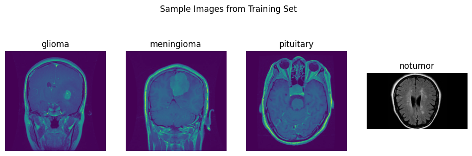
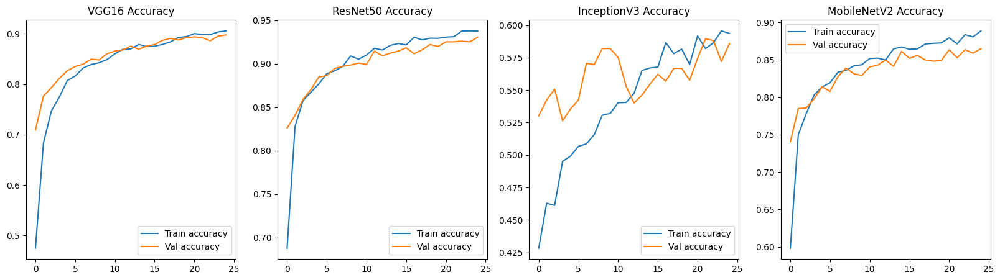
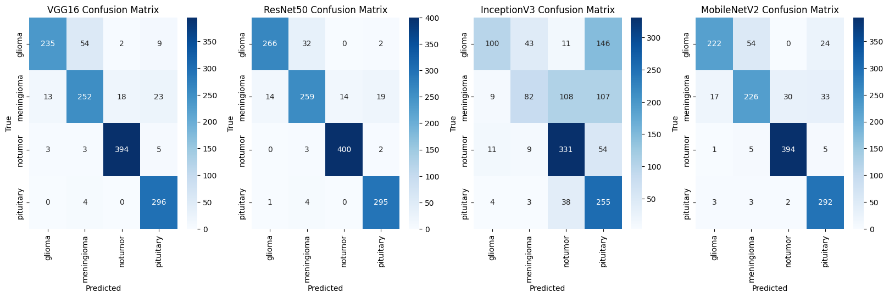
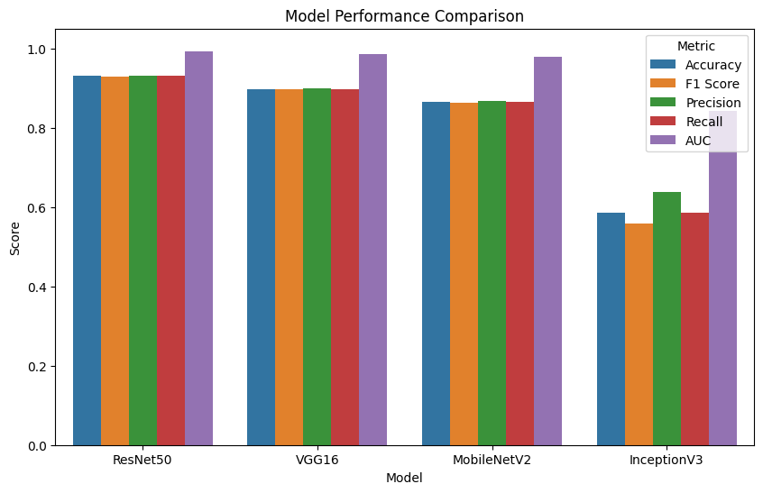

# 🧠 Comparative-Analysis-of-Transfer-Learning-Models-for-Brain-Tumor-Classification

This project classifies brain MRI images into four categories of tumor presence using deep learning and pretrained models like **VGG16**, **ResNet50**, **InceptionV3**, and **MobileNetV2**. It uses **TensorFlow/Keras**, **Google Colab**, and a well-structured dataset sourced from brain tumor MRI images.

---

## 📁 Dataset Structure

* Dataset is a ZIP file uploaded to Google Drive.
* It is extracted and loaded via Colab into:

  ```
  Brain_Tumor_Dataset/
  ├── Training/
  │   ├── glioma/
  │   ├── meningioma/
  │   ├── pituitary/
  │   └── notumor/
  └── Testing/
      ├── glioma/
      ├── meningioma/
      ├── pituitary/
      └── notumor/
  ```

---

## 🧪 Workflow Overview

```
[ Google Drive + Dataset ZIP ]
            |
   [ Setup & Extraction in Colab ]
            |
  [ Data Preprocessing & Augmentation ]
            |
  [ CNNs (VGG16, ResNet50, InceptionV3, MobileNetV2) ]
            |
     [ Model Training & Evaluation ]
            |
[ Accuracy, F1 Score, AUC, Confusion Matrix ]
            |
    [ Performance Comparison (Chart + Table) ]
```

---

## 🔍 Key Features

✅ Mount Google Drive and unzip the dataset
✅ Count images per class and plot distribution
✅ Show random sample image from each class
✅ Use `ImageDataGenerator` with transfer learning-specific preprocessing
✅ Build and train CNNs with frozen base layers
✅ Evaluate using:

* Accuracy
* Precision
* Recall
* F1 Score
* ROC AUC
* Confusion Matrix
  ✅ Visual comparison of all models

---

## 📊 Dataset Insights

* Balanced class distribution across training/testing sets
* Example categories:

  * `glioma`, `meningioma`, `pituitary`, `notumor`



---

## 🧠 Models Used

| Model           | Description                                         |
| --------------- | --------------------------------------------------- |
| **VGG16**       | Simple deep CNN with stacked 3×3 conv layers        |
| **ResNet50**    | Residual connections to prevent vanishing gradients |
| **InceptionV3** | Multi-scale convolutions within inception modules   |
| **MobileNetV2** | Lightweight architecture with inverted residuals    |

---


## 📈 Evaluation Metrics

| Model           | Accuracy | F1 Score | Precision | Recall | AUC    |
| --------------- | -------- | -------- | --------- | ------ | ------ |
| **ResNet50**    | 0.9306   | 0.9299   | 0.9302    | 0.9306 | 0.9919 |
| **VGG16**       | 0.8978   | 0.8965   | 0.8996    | 0.8978 | 0.9849 |
| **MobileNetV2** | 0.8650   | 0.8620   | 0.8667    | 0.8650 | 0.9781 |
| **InceptionV3** | 0.5858   | 0.5588   | 0.6376    | 0.5858 | 0.8435 |


📈 Accuracy Curves
Training vs Validation Accuracy for All Models


🔍 Confusion Matrices
Visualize classification performance and misclassifications:


📊 Metrics Comparison
Bar chart comparing Accuracy, F1, Precision, Recall, and AUC across models:


---

## 🛠 Technologies Used

* Python
* TensorFlow & Keras
* Google Colab
* NumPy, Pandas
* Matplotlib, Seaborn
* PIL
* Scikit-learn

---

